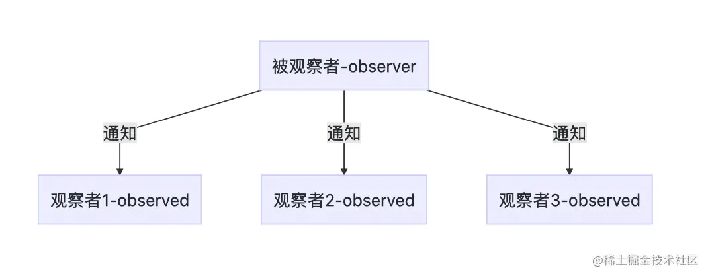

## 响应式原理

### vue的 defineProperty方法/ Proxy 及其作用

defineProperty可以定义 obj上的某个属性:
Object.defineProperty(obj, prop, descriptor)

obj: 要定义属性的对象。
prop: 要定义或修改的属性的名称或 Symbol 。
descriptor: 要定义或修改的属性描述符。

一些特殊的描述符:
configurable: 可配置(一般对应Obj的删除)
emumerable: 可枚举(遍历等)
writable: 属性是否可被修改

```js
const obj = { name: 'zhangsan', age: 14}

// 摘自vue.js源码 observer/index.js
function defineReactive(obj, key, val){
  Object.defineProperty(obj, key, {
    enumerable: true,
    configurable: true,
    // 定义 get方法
    get: function reactiveGetter(){
      // 定义 get拦截器
      const value = val
      // 处理依赖收集等
      return value
    },
    set: function reactiveSetter(newVal){
      const value = val
      // 如果数据没有变化则不触发(Watcher)
      if (newVal === value || (newVal !== newVal && value !== value)) {
        return
      }
      /* .... */
      val = newVal
    }
  })
}

function observeArray(items){
  for (let i = 0, l = items.length; i < l; i++) {
    observe(items[i])
  }
}

// 拦截对象上的所有属性转变响应式对象
function observe(obj){
  const keys = Object.keys(obj)
  for (let i = 0; i < keys.length; i++) {
    defineReactive(obj, keys[i])
    // 如果值是数组, 则observe数组对象
    if(Array.isArray(obj[i])){
      observeArray(obj[i])
    }
  }
}

```

## 依赖收集

### 观察者模式

1. 在收集依赖开始先介绍一下 观察者模式的使用

观察者模式中通常有两个模型，一个观察者（observer）和一个被观察者（Observed）。从字面意思上理解，即被观察者发生某些行为或者变化时，会通知观察者，观察者根据此行为或者变化做出处理。



2. 实现观察者模式

```js
// 观察者
let watcherId = 0
// 被观察者
let observerdId = 0
class Watcher {
  constructor() {
    this.id = watcherId++
  }
  // 观测变化处理
  update(ob) {
    console.log("观察者" + this.id + `-检测到被观察者${ob.id}变化`);
  }
}
// 被观察者
class Observed {
  constructor() {
    this.watchers = [];
    this.id = observerdId++
  }
  //添加观察者
  addWatcher(watcher) {
    this.watchers.push(watcher);
  }
  //通知所有的观察者
  notify() {
    this.watchers.forEach(watcher => {
      watcher.update(this);
    });
  }
}
// 实例化一个被观察者并为他添加 观察者
let observerd = new Observed()
observerd.addWatcher(new Watcher())
observerd.addWatcher(new Watcher())
// 通知观察者
observerd.notify()
```

我们发现观察者模式具备通知的功能类似于我们 vue组件中 watch属性的作用

### 实现Dep和Watcher进行依赖收集

1. Dep类

```js

```