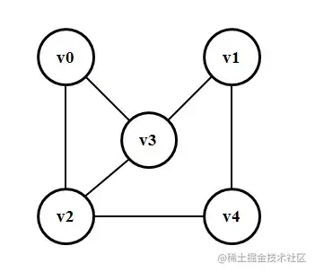

:::tip
介绍在常见电商业务中sku算法和业务效果的处理
:::

<!-- more -->

# sku和商品规格的联系

sku是会计学中的一个名词，被称作库存单元。说人话？简单来讲就是，每一个单规格选项，例如深空灰色、64G,都是一个规格(sku)。商品和sku属于一对多的关系，也就是我们可以选择多个sku来确定到某个具体的商品:


# 邻接矩阵实现

邻接矩阵是通常用来标识简单地图，级联表单，迷宫等

## 无向图和邻接矩阵关系

例如下面一个无向图:


转化为邻接矩阵: 其中用0标识两点直接没有连线, 1标识有连线

```js
const arr = [
// v0  v1  v2  v3  v4
   0,  0,  1,  1,  0, // v0
   0,  0,  0,  1,  1, // v1
   1,  0,  0,  1,  1, // v2
   1,  1,  1,  0,  0, // v3
   0,  1,  1,  0,  0, // v4
]
```

无向图的特点:
- 矩阵的length必然是顶点个数的平方 lengt^2
- 矩阵斜边必然无值
- 矩阵依据斜边对称


简单表示:
```js
class Adjoin {
  constructor(vertex) {
    // 接收顶点
    this.vertex = vertex
    // 顶点长度
    this.quantity = vertex.length
    this.init()
  }
  init() {
    // 数组为顶点的两倍
    this.adjoinArray = Array.from({ length: this.quantity * this.quantity })
  }
  // 为某个定点注册边
  setAdjoinVertexs(id, sides) {
    const pIndex = this.vertex.indexOf(id)
    sides.forEach(item => {
      const index = this.vertex.indexOf(item);
      this.adjoinArray[pIndex * this.quantity + index] = 1;
    })
  }
  // 根据莫一个顶点得到一列数据 
  getVertexRow(id) {
    const index = this.vertex.indexOf(id)
    const col = []
    this.vertex.forEach((item, pIndex) => {
      col.push(this.adjoinArray[index + this.quantity * pIndex]);
    })
    return col
  }
  // 过滤出莫一个顶点的邻接点
  getAdjoinVertexs(id) {
    return this.getVertexRow(id).map((item, index) => {
      return item ? this.vertex[index] : ''
    }).filter(item => !!item)
  }
}
// 创建矩阵
const demo = new Adjoin(['v0', 'v1', 'v2', 'v3', 'v4'])

// 注册邻接点
demo.setAdjoinVertexs('v0', ['v2', 'v3']);
demo.setAdjoinVertexs('v1', ['v3', 'v4']);
demo.setAdjoinVertexs('v2', ['v0', 'v3', 'v4']);
demo.setAdjoinVertexs('v3', ['v0', 'v1', 'v2']);
demo.setAdjoinVertexs('v4', ['v1', 'v2']);
console.log(demo.getAdjoinVertexs('v0')); // => ['v2', 'v3']
```

## 简单的sku数据

```js
const data = [
  { id: '1', specs: [ '紫色', '套餐一', '64G' ] },
  { id: '2', specs: [ '紫色', '套餐一', '128G' ] },
  { id: '3', specs: [ '紫色', '套餐二', '128G' ] },
  { id: '4', specs: [ '黑色', '套餐三', '256G' ] },
];
const commoditySpecs = [
  { title: '颜色', list: [ '红色', '紫色', '白色', '黑色' ] },
  { title: '套餐', list: [ '套餐一', '套餐二', '套餐三', '套餐四' ]},
  { title: '内存', list: [ '64G', '128G', '256G' ] }
];
```

# 参考

- 