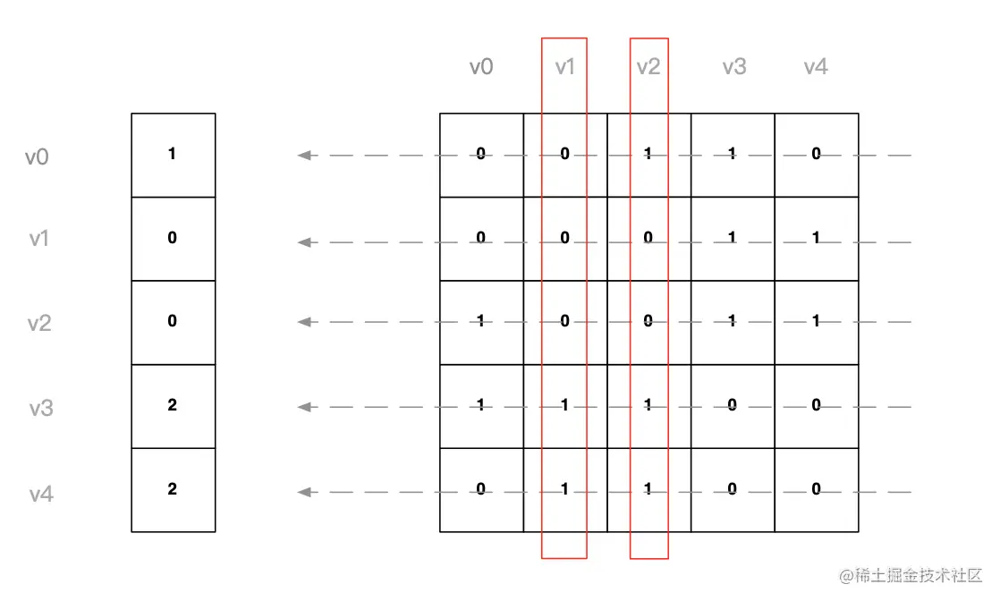

计算sku时候会有许多规格的排列组合和选择逻辑，介绍一下使用邻接矩阵计算商品规格(sku)

<!-- more -->

## sku和商品规格的联系

sku被称作库存单元。简单来讲就是，每一个单规格选项，例如深空灰色、64G,都是一个规格(sku)。
商品和sku属于一对多的关系，也就是我们可以选择多个sku来确定到某个具体的商品:


## sku邻接矩阵实现

邻接矩阵是通常用来标识简单地图，级联表单，迷宫等

### 无向图和邻接矩阵关系

例如下面一个无向图:


转化为邻接矩阵: 其中用0标识两点直接没有连线, 1标识有连线

```js
const arr = [
// v0  v1  v2  v3  v4
   0,  0,  1,  1,  0, // v0
   0,  0,  0,  1,  1, // v1
   1,  0,  0,  1,  1, // v2
   1,  1,  1,  0,  0, // v3
   0,  1,  1,  0,  0, // v4
]
```

无向图的特点:
- 矩阵的length必然是顶点个数的平方 lengt^2
- 矩阵斜边必然无值
- 矩阵依据斜边对称


简单表示:
```js
class Adjoin {
  constructor(vertex) {
    // 接收顶点
    this.vertex = vertex
    // 顶点长度
    this.quantity = vertex.length
    this.init()
  }
  init() {
    // 数组为顶点的两倍
    this.adjoinArray = Array.from({ length: this.quantity * this.quantity })
  }
  // 为某个定点注册边
  setAdjoinVertexs(id, sides) {
    const pIndex = this.vertex.indexOf(id)
    sides.forEach(item => {
      const index = this.vertex.indexOf(item);
      this.adjoinArray[pIndex * this.quantity + index] = 1;
    })
  }
  // 根据莫一个顶点得到一列数据 
  getVertexRow(id) {
    const index = this.vertex.indexOf(id)
    const col = []
    this.vertex.forEach((item, pIndex) => {
      col.push(this.adjoinArray[index + this.quantity * pIndex]);
    })
    return col
  }
  // 过滤出莫一个顶点的邻接点
  getAdjoinVertexs(id) {
    return this.getVertexRow(id).map((item, index) => {
      return item ? this.vertex[index] : ''
    }).filter(item => !!item)
  }
}
// 创建矩阵
const demo = new Adjoin(['v0', 'v1', 'v2', 'v3', 'v4'])

// 注册邻接点
demo.setAdjoinVertexs('v0', ['v2', 'v3']);
demo.setAdjoinVertexs('v1', ['v3', 'v4']);
demo.setAdjoinVertexs('v2', ['v0', 'v3', 'v4']);
demo.setAdjoinVertexs('v3', ['v0', 'v1', 'v2']);
demo.setAdjoinVertexs('v4', ['v1', 'v2']);

// 可以 获取到与v0顶点连接的点
console.log(demo.getAdjoinVertexs('v0')); // => ['v2', 'v3']
```

### 简单的sku数据

```js
const data = [
  { id: '1', specs: [ '紫色', '套餐一', '64G' ] },
  { id: '2', specs: [ '紫色', '套餐一', '128G' ] },
  { id: '3', specs: [ '紫色', '套餐二', '128G' ] },
  { id: '4', specs: [ '黑色', '套餐三', '256G' ] },
];
const commoditySpecs = [
  { title: '颜色', list: [ '红色', '紫色', '白色', '黑色' ] },
  { title: '套餐', list: [ '套餐一', '套餐二', '套餐三', '套餐四' ]},
  { title: '内存', list: [ '64G', '128G', '256G' ] }
];
```

分析：其中commoditySpecs中所有规格都可看做图的顶点
我们选择规格的过程相当于 取每个顶点集合的交集, 可用下图表示



那么我们加入根据规格选项构造交集的过程

```js
class Adjoin {
  constructor(vertex) {
    // 接收顶点
    this.vertex = vertex
    // 顶点长度
    this.quantity = vertex.length
    this.init()
  }

  // 对每列执行矩阵运算
  getRowToatl(params) {
    params = params.map(id => this.getVertexRow(id));
    const adjoinNames = [];
    this.vertex.forEach((item, index) => {
      const rowtotal = params.map(value => value[index]).reduce((total, current) => {
        total += current || 0;
        return total;
      }, 0);
      adjoinNames.push(rowtotal);
    });
    return adjoinNames;
  }

  // 取交集
  getUnions(params) {
    const row = this.getRowToatl(params);
    return row.map((item, index) => item >= params.length && this.vertex[index]).filter(Boolean);
  }

  // 取并集
  getCollection(params) {
    params = this.getRowToatl(params)
    // 只要对应位置上有一个不为 0, 则保存结果，也就是并集
    return params.map((item, index) => item && this.vertex[index]).filter(Boolean);
  }

  init() {
    // 数组为顶点的两倍
    this.adjoinArray = Array.from({ length: this.quantity * this.quantity })
  }

  // 为某个定点注册边
  setAdjoinVertexs(id, sides) {
    const pIndex = this.vertex.indexOf(id)
    sides.forEach(item => {
      const index = this.vertex.indexOf(item);
      this.adjoinArray[pIndex * this.quantity + index] = 1;
    })
  }

  // 根据莫一个顶点得到一列数据 
  getVertexRow(id) {
    const index = this.vertex.indexOf(id);
    const col = [];
    this.vertex.forEach((item, pIndex) => {
      col.push(this.adjoinArray[index + this.quantity * pIndex]);
    });
    return col;
  }

  // 过滤出莫一个顶点的邻接点
  getAdjoinVertexs(id) {
    return this.getVertexRow(id).map((item, index) => {
      return item ? this.vertex[index] : ''
    }).filter(item => !!item)
  }
}

// 结合业务场景创建邻接矩阵
export default class ShopAdjoin extends Adjoin {
  constructor(commoditySpecs, data) {
    // 所有条件都有顶点
    const vertex = commoditySpecs.reduce((total, current) => [
      ...total,
      ...current.list
    ], [])
    // 组合矩阵
    super(vertex)
    // 调用父节点函数构造邻接矩阵
    this.commoditySpecs = commoditySpecs
    this.data = data
    // 创建矩阵
    this.initCommodity()
    // 获得所有的选项，也就是取交，并集的过程
    this.initSimilar()
  }

  initCommodity() {
    this.data.forEach((item) => {
      this.applyCommodity(item.specs);
    });
  }

  initSimilar() {
    // 获得所有可选项
    const specsOption = this.getCollection(this.vertex);
    this.commoditySpecs.forEach((item) => {
      const params = [];
      item.list.forEach((value) => {
        if (specsOption.indexOf(value) > -1) params.push(value);
      });
      // 同级点位创建
      this.applyCommodity(params);
    });
  }

  querySpecsOptions(params) {
    // 判断是否存在选项填一个
    if (params.some(Boolean)) {
      // 过滤一下选项
      params = this.getUnions(params.filter(Boolean));
    } else {
      // 如果未指定选项，则应包含全部的选项取并集
      params = this.getCollection(this.vertex);
    }
    return params;
  }
  // 加入顶点
  applyCommodity(params) {
    params.forEach((param) => {
      this.setAdjoinVertexs(param, params);
    });
  }
}
```

## 实现vue3中 sku的例子

github地址: [vue3-sku-template](https://github.com/guantaocc/vue3-sku-template)

## 参考

- [图解邻接矩阵](https://juejin.cn/post/6844904013801095176)