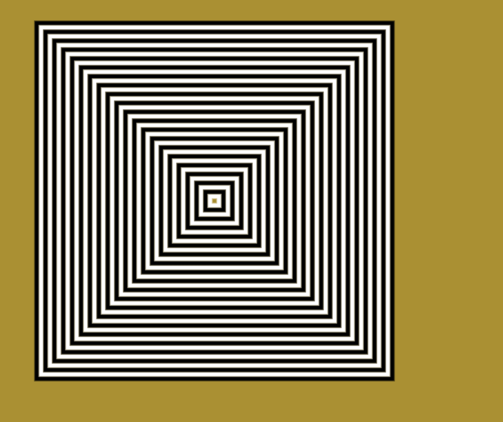
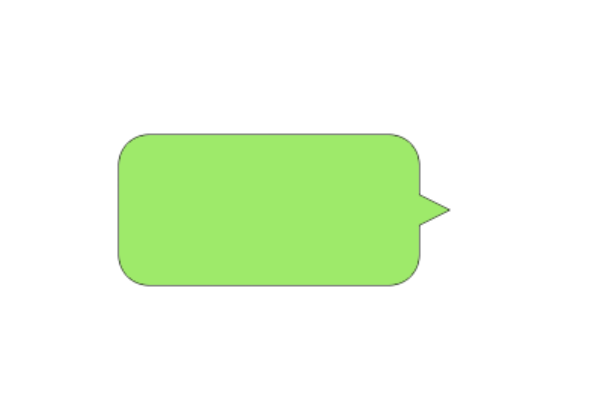

## canvas画一个矩形

:::tip
canvas 使基于状态的绘制，因此需要beginPath 和 closePath的辅助
必须在 moveTo, lineTo等动作做完后再 stroke()
需要注意如果在(0, 0)点绘制时，Canvas 路径在 x 轴和 y 轴方向上都绘制到了起点的外侧
:::

```js
window.onload = function(){
    var canvas = document.getElementById("canvas");
    canvas.width = 800;
    canvas.height = 600;
    var context = canvas.getContext("2d");
    context.beginPath()
    context.moveTo(100,100);
    context.lineTo(300,300);
    context.lineTo(100,500);
    
    context.fillStyle = 'yellow'
    context.lineWidth = 5;
    context.strokeStyle = "#AA394C";
    context.fill()
    context.stroke();
}
```

## 画多个的矩形

convas2d提供了绘制矩形的两个类: fillRect()和strokeRect()

```js
const canvasRef = this.$refs['canvas']
  const context = canvasRef.getContext("2d")
  canvasRef.width = 800
  canvasRef.height = 600
  function drawBlackRect(ctx, x, y, width, height) {
    ctx.beginPath()
    ctx.rect(x, y, width, height)
    ctx.lineWidth = 5
    ctx.strokeStyle = "black";
    ctx.stroke()
  }
  function drawWhiteRect(ctx, x, y, width, height) {
    ctx.beginPath()
    ctx.rect(x, y, width, height)
    ctx.lineWidth = 5
    ctx.strokeStyle = "#fff";
    ctx.stroke()
  }
  context.beginPath()
  context.rect(0, 0, 800, 600)
  context.fillStyle = "#aa9033"
  context.fill()

  context.beginPath()

  for (let i = 0; i < 20; i++) {
    drawBlackRect(context, 200 + 10 * i, 100 + 10 * i, 400 - 20 * i, 400 - 20 * i)
    drawWhiteRect(context, 205 + 10 * i, 105 + 10 * i, 390 - 20 * i, 390 - 20 * i)
  }
```

显示结果:



## 线条属性

线条的属性共有以下四个：

1.  lineCap属性
lineCap 定义上下文中线的端点，可以有以下 3 个值。

butt：默认值，端点是垂直于线段边缘的平直边缘。
round：端点是在线段边缘处以线宽为直径的半圆。
square：端点是在选段边缘处以线宽为长、以一半线宽为宽的矩形。
2. lineJoin属性
lineJoin 定义两条线相交产生的拐角，可将其称为连接。在连接处创建一个填充三角形，可以使用 lineJoin 设置它的基本属性。

miter：默认值，在连接处边缘延长相接。miterLimit 是角长和线宽所允许的最大比例(默认是 10)。
bevel：连接处是一个对角线斜角。
round：连接处是一个圆。
3. 线宽
lineWidth 定义线的宽度(默认值为 1.0)。

4、笔触样式
strokeStyle 定义线和形状边框的颜色和样式。

线条的帽子(端点)
```js
context.beginPath();
context.moveTo(100, 300);
context.lineTo(700, 300);
context.lineCap = "round";
context.stroke();
```

线条的连接
```js
context.lineWidth = 50
context.stokeStyle = '#1baaaa'
context.beginPath()
context.moveTo(100, 100)
context.lineTo(700, 100)
context.lineJoin = "miter";
// 当为miter时, miterLimit属性
context.miterLimit = 10;
context.lineWidth = 20;
context.strokeStyle = "red";
context.lineCap = "round"
context.stroke()
```

## 填充色和渐变
在画布上创建渐变填充有两个基本选项：线性或径向。线性渐变创建一个水平、垂直或者对角线的填充图案。径向渐变自中心点创建一个放射状填充。填充渐变形状分为三步：添加渐变线，为渐变线添加关键色，应用渐变。

1. 添加渐变线：
```js
var grd = context.createLinearGradient(xstart,ystart,xend,yend);
```
2. 为渐变线添加关键色
```js
grd.addColorStop(stop,color);
```
这里的stop传递的是 0 ~ 1 的浮点数，代表断点到(xstart,ystart)的距离占整个渐变色长度是比例。

3. 应用渐变：
```js
context.fillStyle = grd;
context.strokeStyle = grd;
```

线性渐变
```js
context.beginPath();
context.rect(10, 10, 400, 600)
var grd = context.createLinearGradient(100, 400, 200, 400);
grd.addColorStop(0, "black");
grd.addColorStop(0.5, "white");
grd.addColorStop(1, "black");
context.fillStyle = grd;
context.fill();
```

线性渐变结果:


径向渐变：由中间向外发散

```js
// x0, y0, r0 分别为圆的圆心和半径
var grd = context.createRadialGradient(400, 300, 10, 400, 300, 200);

//添加颜色断点
grd.addColorStop(0, "yellow");
grd.addColorStop(0.01, "green");
grd.addColorStop(0.5, "black");
grd.addColorStop(0.75, "White");
grd.addColorStop(1, "Gray");

//应用渐变
context.fillStyle = grd;

context.fillRect(100, 100, 600, 400);
```

径向渐变结果:


## 填充图案

:::tip
createPattern(img,repeat-style)，第一个是Image对象实例(CanvasImageSource对象)，第二个参数是String类型，表示在形状中如何显示repeat图案
:::

```js
ctx.beginPath();
var img = new Image();
img.src = 'https://mdn.mozillademos.org/files/222/Canvas_createpattern.png';
img.onload = function () {
  var pattern = ctx.createPattern(img, 'repeat');
  ctx.fillStyle = pattern;
  ctx.fillRect(0, 0, 400, 400);
};
```

## 绘制复杂路径图形
:::tip
根据不同的一些算法曲线绘制复杂的图形，如三角函数，贝塞尔曲线等
:::

1. arc()圆弧
context.arc(x,y,radius,startAngle,endAngle,anticlockwise)

- 画一个半圆
```js
function drawArt(ctx, x, y, radius) {
  ctx.beginPath()
  ctx.arc(x + radius, y + radius, radius, Math.PI, Math.PI * 3 / 2)
  ctx.fillStyle = "#000"
  ctx.stroke();
}
```
- 画一个圆形的头像并添加边框
```js
var img = new Image();
img.src = 'https://mdn.mozillademos.org/files/222/Canvas_createpattern.png';
img.width = 50
img.height = 50
img.onload = function () {
  // 在 100, 100处画一个圆并裁切
  ctx.beginPath()
  ctx.arc(25, 25, 25, 0, Math.PI * 2, false)
  ctx.clip()
  ctx.drawImage(img, 0, 0, 50, 50)
  ctx.lineWidth = 2
  ctx.strokeStyle = 'red'
  ctx.stroke()
  ctx.closePath()
};
```

2. arcTo 切点绘制弧线
```js
// 使用切点绘制弧线
ctx.beginPath()
ctx.moveTo(200, 200)
// 使用上面moveTo作为起点，因此 200,200一定在圆弧上
ctx.arcTo(600, 200, 600, 400, 100)
ctx.lineWidth = 5
ctx.strokeStyle = "red"
ctx.stroke()
```

```js
// 绘制微信对话框
ctx.beginPath()
ctx.moveTo(100, 180)
// r = 20
ctx.arcTo(100, 100, 120, 100, 20)
ctx.arcTo(300, 100, 300, 120, 20)
ctx.lineTo(300, 140)
ctx.lineTo(320, 150)
ctx.lineTo(300, 160)
ctx.arcTo(300, 200, 280, 200, 20)
ctx.arcTo(100, 200, 100, 180, 20)
ctx.stroke()
ctx.fillStyle = '#9eea6a'
ctx.fill()
```

微信气泡框结果:


## 贝塞尔曲线
:::tip
n阶贝塞尔曲线就有 n-1个控制点
:::

:one: 二次贝塞尔曲线 context.quadraticCurveTo(cpx,cpy,x,y);

:::details 贝塞尔曲线在线转换工具
贝塞尔曲线  [在线转换工具](http://tinyurl.com/html5quadratic)。
:::

```js
var context = canvas.getContext("2d");
context.fillStyle = "#FFF";
context.fillRect(0,0,800,600);

context.lineWidth = 6;
context.strokeStyle = "#333";
context.beginPath();
context.moveTo(60, 337);
context.quadraticCurveTo(256, 43, 458, 336);
context.stroke();
```

:two: 三次贝塞尔曲线: context.bezierCurveTo(cp1x,cp1y,cp2x,cp2y,x,y);

## 保存状态

save: 保存之前绘制的状态
restore: 恢复之前的状态并继续绘制

```js
var ctx = canvas.getContext("2d");

ctx.save(); // 保存默认的状态

ctx.fillStyle = "green";
ctx.fillRect(10, 10, 100, 100);

ctx.restore(); // 还原到上次保存的默认状态
ctx.fillRect(150, 75, 100, 100);
```


## 平移变换

canvas变换跟 css变换api相似
:::warning
注意涉及到坐标系原点的操作最好 save 之后再 restore使坐标系恢复到原点
:::

:one: 平移变换: translate(x, y)
```js
ctx.fillStyle = "#00AAAA";
ctx.fillRect(100, 100, 200, 100);

// 在平移之前保存状态
ctx.save();
ctx.fillStyle = "red";
ctx.translate(100, 100);
ctx.fillRect(100, 100, 200, 100);
// 平移坐标系之后将坐标系释放到(0, 0)原点
ctx.restore();
```
:two: 旋转变换: rotate(deg)
:three: 缩放变换: scale()

