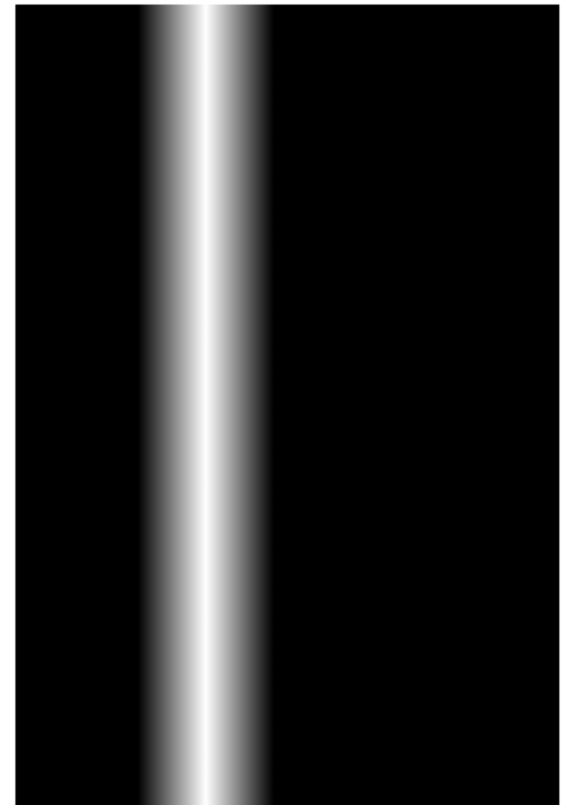
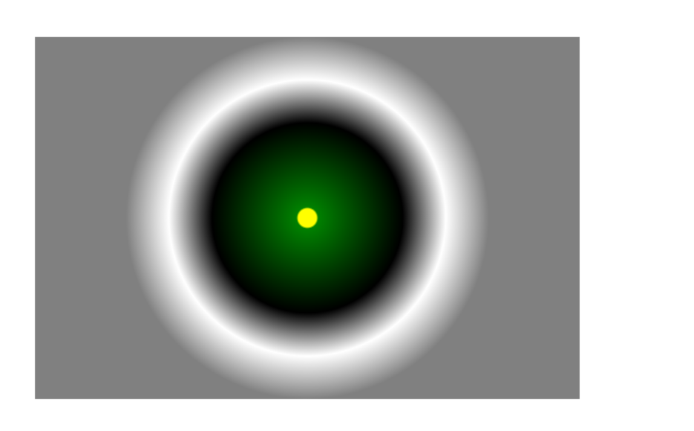

## canvas画一个矩形

:::tip
canvas 使基于状态的绘制，因此需要beginPath 和 closePath的辅助
必须在 moveTo, lineTo等动作做完后再 stroke()
需要注意如果在(0, 0)点绘制时，Canvas 路径在 x 轴和 y 轴方向上都绘制到了起点的外侧
:::

```js
window.onload = function(){
    var canvas = document.getElementById("canvas");
    canvas.width = 800;
    canvas.height = 600;
    var context = canvas.getContext("2d");
    context.beginPath()
    context.moveTo(100,100);
    context.lineTo(300,300);
    context.lineTo(100,500);
    
    context.fillStyle = 'yellow'
    context.lineWidth = 5;
    context.strokeStyle = "#AA394C";
    context.fill()
    context.stroke();
}
```

## 画多个的矩形

convas2d提供了绘制矩形的两个类: fillRect()和strokeRect()

```js
const canvasRef = this.$refs['canvas']
  const context = canvasRef.getContext("2d")
  canvasRef.width = 800
  canvasRef.height = 600
  function drawBlackRect(ctx, x, y, width, height) {
    ctx.beginPath()
    ctx.rect(x, y, width, height)
    ctx.lineWidth = 5
    ctx.strokeStyle = "black";
    ctx.stroke()
  }
  function drawWhiteRect(ctx, x, y, width, height) {
    ctx.beginPath()
    ctx.rect(x, y, width, height)
    ctx.lineWidth = 5
    ctx.strokeStyle = "#fff";
    ctx.stroke()
  }
  context.beginPath()
  context.rect(0, 0, 800, 600)
  context.fillStyle = "#aa9033"
  context.fill()

  context.beginPath()

  for (let i = 0; i < 20; i++) {
    drawBlackRect(context, 200 + 10 * i, 100 + 10 * i, 400 - 20 * i, 400 - 20 * i)
    drawWhiteRect(context, 205 + 10 * i, 105 + 10 * i, 390 - 20 * i, 390 - 20 * i)
  }
```

显示结果:


## 线条属性

线条的属性共有以下四个：

1.  lineCap属性
lineCap 定义上下文中线的端点，可以有以下 3 个值。

butt：默认值，端点是垂直于线段边缘的平直边缘。
round：端点是在线段边缘处以线宽为直径的半圆。
square：端点是在选段边缘处以线宽为长、以一半线宽为宽的矩形。
2. lineJoin属性
lineJoin 定义两条线相交产生的拐角，可将其称为连接。在连接处创建一个填充三角形，可以使用 lineJoin 设置它的基本属性。

miter：默认值，在连接处边缘延长相接。miterLimit 是角长和线宽所允许的最大比例(默认是 10)。
bevel：连接处是一个对角线斜角。
round：连接处是一个圆。
3. 线宽
lineWidth 定义线的宽度(默认值为 1.0)。

4、笔触样式
strokeStyle 定义线和形状边框的颜色和样式。

线条的帽子(端点)
```js
context.beginPath();
context.moveTo(100, 300);
context.lineTo(700, 300);
context.lineCap = "round";
context.stroke();
```

线条的连接
```js
context.lineWidth = 50
context.stokeStyle = '#1baaaa'
context.beginPath()
context.moveTo(100, 100)
context.lineTo(700, 100)
context.lineJoin = "miter";
// 当为miter时, miterLimit属性
context.miterLimit = 10;
context.lineWidth = 20;
context.strokeStyle = "red";
context.lineCap = "round"
context.stroke()
```

## 填充色和渐变
在画布上创建渐变填充有两个基本选项：线性或径向。线性渐变创建一个水平、垂直或者对角线的填充图案。径向渐变自中心点创建一个放射状填充。填充渐变形状分为三步：添加渐变线，为渐变线添加关键色，应用渐变。

1. 添加渐变线：
```js
var grd = context.createLinearGradient(xstart,ystart,xend,yend);
```
2. 为渐变线添加关键色
```js
grd.addColorStop(stop,color);
```
这里的stop传递的是 0 ~ 1 的浮点数，代表断点到(xstart,ystart)的距离占整个渐变色长度是比例。

3. 应用渐变：
```js
context.fillStyle = grd;
context.strokeStyle = grd;
```

线性渐变
```js
context.beginPath();
context.rect(10, 10, 400, 600)
var grd = context.createLinearGradient(100, 400, 200, 400);
grd.addColorStop(0, "black");
grd.addColorStop(0.5, "white");
grd.addColorStop(1, "black");
context.fillStyle = grd;
context.fill();
```

结果:


径向渐变：由中间向外发散

```js
// x0, y0, r0 分别为圆的圆心和半径
var grd = context.createRadialGradient(400, 300, 10, 400, 300, 200);

//添加颜色断点
grd.addColorStop(0, "yellow");
grd.addColorStop(0.01, "green");
grd.addColorStop(0.5, "black");
grd.addColorStop(0.75, "White");
grd.addColorStop(1, "Gray");

//应用渐变
context.fillStyle = grd;

context.fillRect(100, 100, 600, 400);
```

径向渐变结果:
