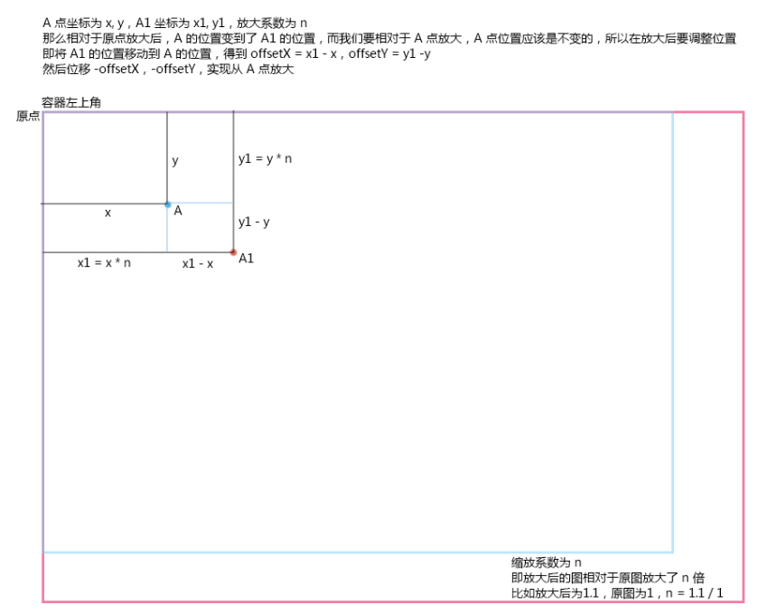

## 注意事项

:::tip
缩放的偏移量的计算:
鼠标距原始点距离(x，y) 除以 缩放值 scale 再乘以 缩放率 this.scaleStep

缩放后鼠标的真实位置计算:
鼠标距原始点距离(x, y) 减去 偏移量 再除以 缩放值 scale
:::

## canvas 基于原点的缩放和展示

canvas 基于原点缩放时


## 最终结果

```js
let canvas = document.getElementById("container");

canvas.style.border = "1px solid #333";

let ctx = canvas.getContext("2d");

const canvasConfig = {
  IDLE: 0,
  DRAG_START: 1,
  DRAGING: 2,
};

const canvasInfo = {
  status: canvasConfig.IDLE,
  lastShapePos: { x: 0, y: 0 },
  shapePos: { x: 0, y: 0 },
  mouseEvtPos: { x: 0, y: 0 },
  lastMouseEvtPos: { x: 0, y: 0 },
  offset: {
    x: 0,
    y: 0,
  },
  scale: 1,
  scaleStep: 0.1,
  maxScale: 2,
  minScale: 0.5,
};

const drawShape = (ctx, x, y, r) => {
  ctx.beginPath();
  ctx.arc(x, y, r, 0, Math.PI * 2);
  ctx.stroke();
};

drawShape(ctx, 100, 100, 50);

canvasInfo.lastShapePos = { x: 100, y: 100 };

const getMousePosition = (e, offset = { x: 0, y: 0 }, scale = 1) => {
  return {
    x: (e.offsetX - offset.x) / scale,
    y: (e.offsetY - offset.y) / scale,
  };
};

const getMouseDistance = (mousePos, shapePos) => {
  return Math.sqrt(
    (mousePos.x - shapePos.x) ** 2 + (mousePos.y - shapePos.y) ** 2
  );
};

// 是否在圆内
const isInCircleShape = (pos) => {
  return getMouseDistance(pos, canvasInfo.lastShapePos) < 50;
};

// 是否是移动状态
const isDragorMoving = () => {
  return canvasInfo.status > 0;
};

// 是否触发拖拽
const isAllowDrag = (e) => {
  return getMouseDistance(e, canvasInfo.lastShapePos) > 5;
};

canvas.addEventListener("mousedown", (e) => {
  const pos = getMousePosition(e, canvasInfo.offset, canvasInfo.scale);
  if (isInCircleShape(pos)) {
    canvasInfo.status = canvasConfig.DRAG_START;
    canvasInfo.lastMouseEvtPos = pos;
  }
});

// 画布的缩放事件
canvas.addEventListener("wheel", (e) => {
  e.preventDefault();
  // 中心点放缩
  const { scaleStep, scale } = canvasInfo;
  const realPosition = getMousePosition(e, canvasInfo.offset);

  // 计算缩放的偏移
  const deltaX = (realPosition.x * scaleStep) / scale;
  const deltaY = (realPosition.y * scaleStep) / scale;
  if (e.deltaY > 0) {
    console.log("down");
    canvasInfo.offset.x += deltaX;
    canvasInfo.offset.y += deltaY;
    canvasInfo.scale -= canvasInfo.scaleStep;
  } else {
    canvasInfo.offset.x -= deltaX;
    canvasInfo.offset.y -= deltaY;
    canvasInfo.scale += canvasInfo.scaleStep;
    console.log("up");
  }
  ctx.setTransform(
    canvasInfo.scale,
    0,
    0,
    canvasInfo.scale,
    canvasInfo.offset.x,
    canvasInfo.offset.y
  );
  ctx.clearRect(0, 0, canvas.width, canvas.height);
  drawShape(ctx, canvasInfo.lastShapePos.x, canvasInfo.lastShapePos.y, 50);
  ctx.restore();
});

canvas.addEventListener("mousemove", (e) => {
  const pos = getMousePosition(e, canvasInfo.offset, canvasInfo.scale);
  canvasInfo.mouseEvtPos = pos;

  if (isInCircleShape(pos)) {
    canvas.style.cursor = "grab";
  } else {
    canvas.style.cursor = "";
  }

  if (isDragorMoving() && isAllowDrag(e)) {
    canvasInfo.status = canvasConfig.DRAGING;
  }

  if (canvasInfo.status === canvasConfig.DRAGING) {
    // 计算鼠标偏移量并改变 shape偏移位置
    let offsetX = canvasInfo.mouseEvtPos.x - canvasInfo.lastMouseEvtPos.x;
    let offsetY = canvasInfo.mouseEvtPos.y - canvasInfo.lastMouseEvtPos.y;
    canvasInfo.shapePos.x = canvasInfo.lastShapePos.x + offsetX;
    canvasInfo.shapePos.y = canvasInfo.lastShapePos.y + offsetY;
    console.log("pos", canvasInfo.shapePos);
    let { x, y } = canvasInfo.shapePos;
    console.log("offset", canvasInfo.offset, canvas.width);
    // 缩放后画布变化, 原点向右和向下偏移
    ctx.clearRect(0, 0, canvas.width, canvas.height);
    drawShape(ctx, x, y, 50);
  }
});

document.addEventListener("mouseup", (e) => {
  if (canvasInfo.status > 0) {
    document.cursor = "";
    canvasInfo.status = canvasConfig.IDLE;
    canvasInfo.lastShapePos = canvasInfo.shapePos;
    canvasInfo.shapePos = {};
  }
});
```
