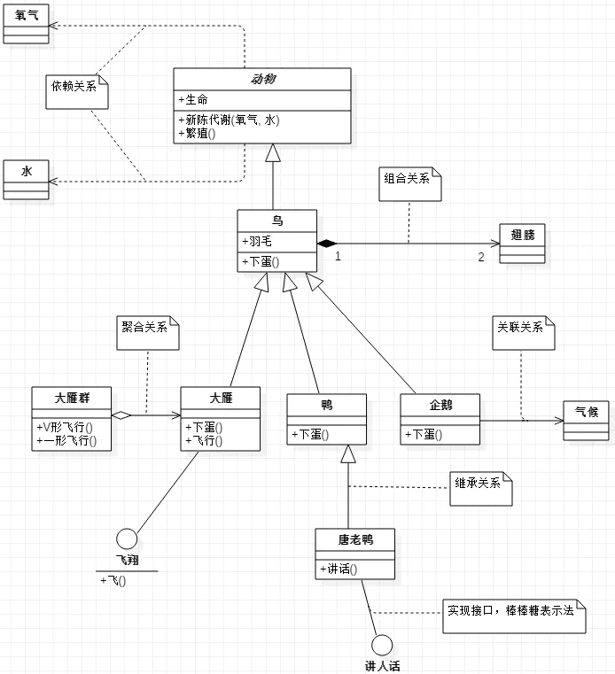

## 什么是设计模式?

设计模式是一套被反复使用的、多数人知晓的、经过分类编目的、代码设计经验的总结。使用设计模式是为了重用代码、让代码更容易被他人理解、保证代码可靠性。

## UML类图

在UML类图中，常见的有以下几种关系: 泛化（Generalization）, 实现（Realization），关联（Association)，聚合（Aggregation），组合(Composition)，依赖(Dependency)

## 面向对象

面向对象的三大特性: 继承，封装，多态

继承: 子类继承父类
封装: 数据的权限和保密 public private protected
多态: 同一接口的不同实现 eg: typescript interface类型

## 设计原则

五大设计原则: 

## 设计模式的类型

创建型模式，共五种：工厂方法模式、抽象工厂模式、单例模式、建造者模式、原型模式。

结构型模式，共七种：适配器模式、装饰器模式、代理模式、外观模式、桥接模式、组合模式、享元模式。

行为型模式，共十一种：策略模式、模板方法模式、观察者模式、迭代子模式、责任链模式、命令模式、备忘录模式、状态模式、访问者模式、中介者模式、解释器模式。

